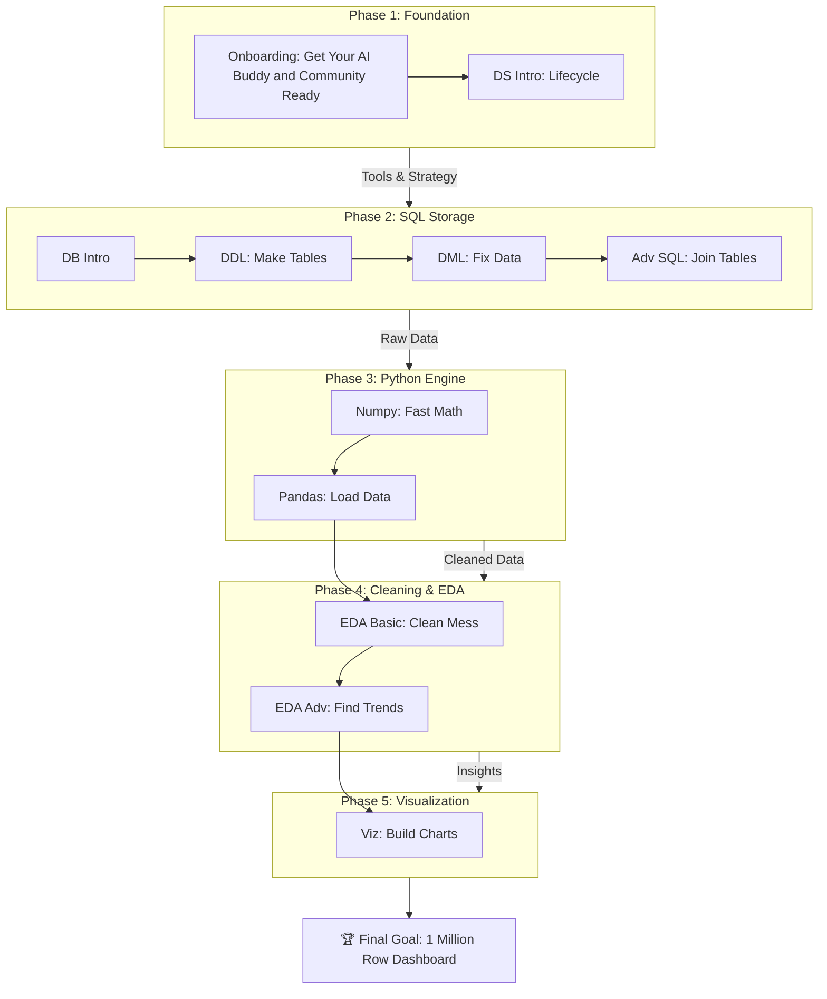

# **🗺️ The Road to the "1 Million Row" Dashboard**

## **How Every Class Contributes to the Final Goal**

**The Final Destination:**

*By Class 15, you will analyze a database with 1+ million records and present a professional dashboard identifying key business insights.*

### **🟢 Phase 1: The Foundation (Setting the Mindset)**

*Before we touch the data, we need the tools and the strategy.*

| Class | Title | 🎯 Contribution to Final Project |
| :---- | :---- | :---- |
| **01** | **Onboarding** | Sets up your **Google NotebookLM & Discord** to kick start your learning journey|
| **02** | **Intro to Data Science** | teaches you the **Data Lifecycle** so you know the steps to follow for the project (Collection \-\> Cleaning \-\> Viz). |

### **🔵 Phase 2: The Warehouse (Getting the Data)**

*You cannot analyze 1 million rows in Excel. You need a database. This phase builds the "Backend" of your project.*

| Class | Title | 🎯 Contribution to Final Project |
| :---- | :---- | :---- |
| **03** | **Intro to Database** | Helps you understand the **schema** (map) of the massive dataset you will be given. |
| **04** | **SQL Basic (DDL)** | Teaches you how to **create the tables** to store the 1 million rows. |
| **05** | **SQL Basic (DML)** | Teaches you how to **manipulate data** in specific rows of the raw data. |
| **06** | **Coaching 1: GitHub & VS Code** | Ensures you can **save your versions** so you don't lose your work if your computer crashes. |
| **07** | **SQL Advanced** | Crucial\! You will use **JOINS** to connect the "Customer" table to the "Transactions" table to find spending habits. |

### **🟠 Phase 3: The Engine (Crunching the Numbers)**

*SQL gets the data, but Python does the heavy mathematical lifting.*

| Class | Title | 🎯 Contribution to Final Project |
| :---- | :---- | :---- |
| **08** | **Intro to Numpy** | Teaches you **vectorization**—the only way to calculate stats on 1 million rows without crashing your browser. |
| **09** | **Coaching 2** | Bridges the gap between "Querying" (SQL) and "Programming" (Python). |
| **10** | **Intro to Pandas** | The **core tool**. You will use DataFrames to hold the data in memory and perform complex filtering (e.g., "Show me top 10% of users"). |

### **🟣 Phase 4: The Detective Work (Finding Insights)**

*Now that the data is loaded, we need to find the "Gold" hidden in the noise.*

| Class | Title | 🎯 Contribution to Final Project |
| :---- | :---- | :---- |
| **11** | **EDA Basic** | **Cleaning.** Real data is dirty. You will use this to remove nulls and duplicates from the 1 million rows. |
| **12** | **Coaching 2** | A practice run to ensure your cleaning scripts are robust enough for the final dataset. |
| **13** | **EDA Advanced** | **Feature Engineering.** You will create *new* metrics (e.g., converting "Date of Birth" into "Age Group") to make your dashboard more useful. |

### **🔴 Phase 5: The Story (The Dashboard)**

*Analysis is useless if no one understands it. This is the "Frontend".*

| Class | Title | 🎯 Contribution to Final Project |
| :---- | :---- | :---- |
| **14** | **Data Visualization** | Generates the **Charts & Graphs** (Bar, Line, Scatter) that go onto your dashboard. |
| **15** | **Capstone Presentation** | You combine everything into a single notebook and **present your findings** to the class. |

### **🧩 Visual Dependency Tree**

